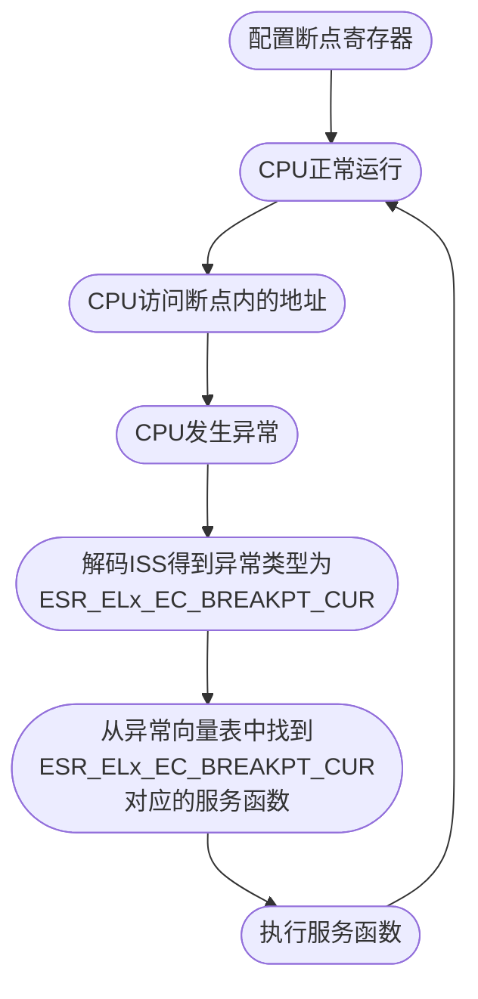
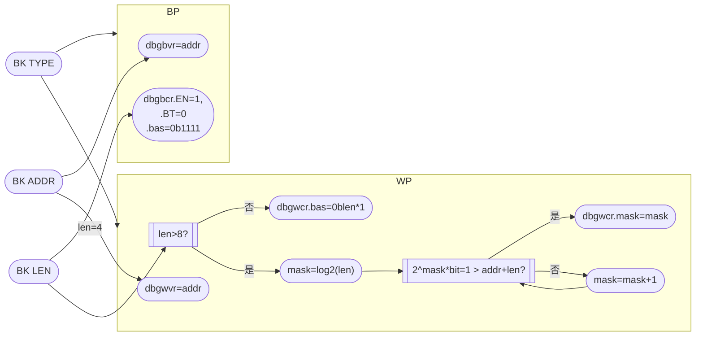

# 硬件断点是什么

硬件断点是cpu自带的用于调试程序的断点，分为执行断点和内存断点。比如armv8架构，它有4个内存断点和6个执行断点。执行断点是最常见的断点类型，就是在某个程序地址处加断点，CPU运行到这里时就会触发，触发长度是4字节。而内存断点是，监控某一个内存区间，当CPU试图访问或者是操作这块内存时就会触发，触发长度可以是[1,8]字节，或是(8,2G]字节，其中8~2G的区间内只能是2的幂。

# 硬件断点的实现机制

cpu的架构不同，硬件断点的机制也不同。通常都是配置好对应的断点寄存器后，CPU触发断点，触发调试异常，进入中断执行相应操作后退出。大概流程如下图所示：



## 断点寄存器解析

以armv8为例，比如cotex-a55核心，每个断点都有2个用于控制硬件断点的寄存器。如下所示：()下面表格中的N代表第几个断点，X代表异常等级，比如el0, el1, el2)

| name          | explain                |
| ------------- | ---------------------- |
| `dbgbvrN_elX` | 执行断点地址设置寄存器 |
| `dbgbcrN_elX` | 执行断点控制寄存器     |
| `dbgwvrN_elX` | 观察断点地址设置寄存器 |
| `dbgwcrN_elX` | 观察断点控制寄存器     |

### `dbgbvrN_elX`

设置执行断点的地址，linux里直接填入对应函数的虚拟地址即可。

### `dbgbcrN_elX`

执行断点的控制寄存器，共有31BIT。用于控制断点的各种属性。具体如下所示：

| 31~24 | 23~20 | 19~16 | 15~14 |  13  | 12~9 | 8~5  | 4~3  | 2~1  |  0   |
| :---: | :---: | :---: | :---: | :--: | :--: | :--: | :--: | :--: | :--: |
| RES2  |  BT   |  LBN  |  SSC  | HMC  | RES1 | BAS  | RES0 | PMC  |  E   |

其中比较常用的是E, PMC, BT。

* E是断点使能位，高位使能。
* PMC用于记录上次控制时的异常等级，配合HMC和SSC一起使用
* BT是控制断点触发的条件，默认是0b0000，对应的触发条件是当地址匹配时触发。

### `dbgwvrN_elX`

设置观察断点的地址，linux里直接填入想观察的内存区域的起始地址即可。

### `dbgwcrN_elX`

观察断点的控制寄存器，共有31bit，用于控制观察断点的各种属性。具体如下所示：

| 31~29 | 28~24 | 23~21 |  20  | 19~16 | 15~14 |  13  | 12~5 | 4~3  | 2~1  |  0   |
| ----- | :---: | :---: | :--: | :---: | :---: | :--: | :--: | :--: | :--: | :--: |
| RES1  | MASK  | RES0  |  WT  |  LBN  |  SSC  | HMC  | BAS  | LSC  | PAC  |  E   |

其中比较常用的是E, PAC, BAS, MASK。

* E是断点使能位，高位使能。
* PAC用于记录上次控制时的异常等级，配合HMC和SSC一起使用
* BAS一共8bit，代表要监控的内存大小，每1bit代表1byte，最大可检测8bytes。
* MASK代表使用掩码的模式监控地址，共有5bit，代表可以掩掉dbgwvrN_elX中的0~31位低地址。

#### MASK举例

比如想监控的地址是 `0xffffffc0622a5c10, MASK=0b00111`

则监控的范围是：`0xffffffc0622a5c00~0xffffffc0622a5c7f`，实际的 `dbgwcrN_elX=0xffffffc0622a5c00`

假如 `MASK=0b01100`

则监控的范围是：`0xffffffc0622a5000~0xffffffc0622a5fff`，实际的 `dbgwcrN_elX=0xffffffc0622a5000`

# 实现硬件断点驱动

在linux内核里其实有硬件断点功能，但是这个硬件断点不太好用，它依赖太多的配置选项。开了这些配置选项除了内核需要重编之外，由于头文件变更过大，所以所有的驱动也要重编。而且内核的硬件断点只能监控8字节，也不支持设置断点触发事件，自定义属性太少。

## 硬件断点需要实现的部分

实现硬件断点驱动，主要是需要实现以下几部分：

1. 注册自己的断点异常服务函数。
2. 根据设定的地址和长度自动解析需配置的硬件断点寄存器值。
3. 设置硬件断点寄存器。

## 硬件断点实现需要的内核接口

上述部分的实现依赖一些内核接口，这些接口内核是没有导出符号的，不过只要开启了 `CONFIG_KALLSYMS=y`，函数都是可以查询的到的。

涉及的接口如下：

```c
typedef struct HW_kernelApi
{
    struct
    {
        unsigned long (*kallsyms_lookup_name)(const char *name); /*根据符号查询地址函数*/
        void (*register_step_hook)(struct step_hook *hook);      /*注册step调试异常hook的函数*/
        void (*unregister_step_hook)(struct step_hook *hook);    /*取消注册step调试异常hook的函数*/
        void (*enable_debug_monitors)(enum dbg_active_el el);    /*使能debug异常*/
        void (*disable_debug_monitors)(enum dbg_active_el el);   /*失能debug异常*/
        int (*kernel_active_single_step)(void);                  /*单步调试是否激活*/
        void (*kernel_enable_single_step)(struct pt_regs *regs); /*使能单步调试异常*/
        void (*kernel_disable_single_step)(void);                /*失能单步调试异常*/
        u64 (*read_sanitised_ftr_reg)(u32 id);                   /*读ftr寄存器*/
        void (*show_regs)(struct pt_regs *);                     /*显示堆栈*/
        void (*do_bad)(unsigned long addr, unsigned int esr, struct pt_regs *regs); /*调试异常的默认中断处理函数*/
    } __aligned(128) fun;
    struct
    {
#ifdef CONFIG_CPU_PM
        u64 *hw_breakpoint_restore;         /*cpu从调试暂停恢复运行时执行的函数*/
        u64  default_hw_breakpoint_restore; /*接管之前的函数地址*/
#endif
        struct fault_info *debug_fault_info;      /*接管硬件断点调试异常中断，替换回调函数*/
        struct fault_info  default_fault_info[2]; /*接管之前的数据信息*/
    } __aligned(128) val;
} HW_kernelApi;
```

我记得在linux 5.7.0之后的内核版本，kallsyms_lookup_name这个根据符号查询地址的函数，是不再导出了。所以驱动中需要先找到这个符号的地址，再用这个地址去查询其余需要的内核接口即可。寻找kallsyms_lookup_name的代码如下：

```c
/*根据名字找函数地址*/
unsigned long kaddr_lookup_name(const char *fname_raw)
{
    int           i;
    unsigned long kaddr;
    char         *fname_lookup, *fname;

    fname_lookup = kzalloc(NAME_MAX, GFP_KERNEL);
    if (!fname_lookup)
        return 0;

    fname = kzalloc(strlen(fname_raw) + 4, GFP_KERNEL);
    if (!fname)
        return 0;

    /*第一个0x0代表是该符号的起始地址*/
    strcpy(fname, fname_raw);
    strcat(fname, "+0x0");

    /*获取内核代码段基地址*/
    kaddr  = (unsigned long)&sprint_symbol;
    kaddr &= 0xffffffffff000000;

    /*内核符号不会超过0x100000*16的大小，所以按4字节偏移，挨个找*/
    for (i = 0x0; i < 0x400000; i++)
    {
        /*寻找地址对应的符号名称*/
        sprint_symbol(fname_lookup, kaddr);
        /*对比寻找的符号名字*/
        if (strncmp(fname_lookup, fname, strlen(fname)) == 0)
        {
            /*找到了就返回地址*/
            kfree(fname_lookup);
            kfree(fname);
            return kaddr;
        }
        /*偏移4字节*/
        kaddr += 0x04;
    }
    /*没找到地址就返回0*/
    kfree(fname_lookup);
    kfree(fname);
    return 0;
}
```

## 解析要设置断点信息

对于使用者来说，是不需要关注每个断点寄存器应该配什么值，只需要知道以下几点就行了：

1. 断点类型：执行断点或是读/写断点。
2. 断点地址
3. 断点监控的长度

所以这部分需要解析对应调用者传入的参数，自动解析出寄存器需要配置的值。流程如下：



## 实现断点异常服务函数

以观察断点服务函数为例，当一个观察断点触发时需要如下几步。

1. 先关闭所有观察断点，防止其一直触发。
2. 遍历所有已设置的观察断点，求出触发的地址与设置的地址正向距离最近的那个断点。
3. 取出断点数据结构，筛选该地址是否在期望监控的地址范围内。
4. 执行用户函数。
5. 在当前regs开启single step
6. 进入single step异常服务函数
7. 重新开启断点。

至此整个流程完毕，执行断点流程类似。代码如下所示：

```c
/*watchpoint回调函数*/
static int HW_watchpointHandler(unsigned long addr, unsigned int esr, struct pt_regs *regs)
{
    int                       i, *kernel_step, access, closest_match = -1;
    u64                       min_dist = -1, dist;
    u32                       ctrl_reg;
    u64                       val, startAddr, endAddr;
    struct HW_breakpointInfo *wp, **slots;
    // struct debug_info *debug_info;
    HW_breakpointVC     *info = NULL;
    HW_breakpointCtrlReg ctrl;

    slots = this_cpu_ptr(wp_on_reg);
    // debug_info = &current->thread.debug;

    /*
	 * Find all watchpoints that match the reported address. If no exact
	 * match is found. Attribute the hit to the closest watchpoint.
	 */
    rcu_read_lock();
    for (i = 0; i < core_num_wrps; ++i)
    {
        wp = slots[i];
        if (wp == NULL)
            continue;

        /*
		 * Check that the access type matches.
		 * 0 => load, otherwise => store
		 */
        access = (esr & AARCH64_ESR_ACCESS_MASK) ? HW_BREAKPOINT_W : HW_BREAKPOINT_R;
        if (!(access /*& hw_breakpoint_type(wp)待实现，将wp与attr->type关联*/))
            continue;

        /* Check if the watchpoint value and byte select match. */
        val      = HW_readBreakpointReg(AARCH64_DBG_REG_WVR, i);
        ctrl_reg = HW_readBreakpointReg(AARCH64_DBG_REG_WCR, i);
        HW_decodeCtrlReg(ctrl_reg, &ctrl);
        dist = HW_getDistanceFromWatchpoint(addr, wp->attr.addr, &ctrl);
        if (dist < min_dist)
        {
            min_dist      = dist;
            closest_match = i;
        }
        /* Is this an exact match? */
        if (dist != 0)
            continue;
        info          = HW_counterArchbp(wp);
        info->trigger = addr;
        closest_match = i;
    }
    if (min_dist > 0 && min_dist != -1)
    {
        /* No exact match found. */
        wp            = slots[closest_match];
        info          = HW_counterArchbp(wp);
        info->trigger = addr;
    }
    rcu_read_unlock();

    /*关闭所有断点*/
    HW_toggleBpRegisters(AARCH64_DBG_REG_WCR, DBG_ACTIVE_EL0, 0);
    HW_toggleBpRegisters(AARCH64_DBG_REG_WCR, DBG_ACTIVE_EL1, 0);
    kernel_step = this_cpu_ptr(&stepping_kernel_bp);

    // printk("watchpoint is trigger,addr=0x%lx, close = %d, dist = %d, mindist = %d, info = %lx\n",
    //        addr, closest_match, dist, min_dist);
    if (info)
    {
        wp = container_of(info, struct HW_breakpointInfo, info);
        if (addr >= wp->attr.addr && addr < wp->attr.addr + wp->attr.len)
        {
            /*在期望检测的地址范围之内，才打印堆栈信息*/
            printk("wp is triger = 0x%llx, addr = 0x%llx, len = %d\n", addr, wp->attr.addr, wp->attr.len);
            kernelApi.fun.show_regs(regs);
        }
        info->trigger = 0;
    }

    if (*kernel_step != ARM_KERNEL_STEP_NONE)
        return 0;

    if (kernelApi.fun.kernel_active_single_step())
    {
        *kernel_step = ARM_KERNEL_STEP_SUSPEND;
    }
    else
    {
        *kernel_step = ARM_KERNEL_STEP_ACTIVE;
        /*在当前regs触发step异常*/
        kernelApi.fun.kernel_enable_single_step(regs);
    }
    // }

    return 0;
}
```

## 注册调试异常服务函数

当断点触发时，是会进入到内核的调试异常服务函数，这个函数里会解析异常类型，去运行对应的断点调试异常函数。内核默认的断点调试异常函数是 `do_bad`，这是一个空函数。需要将这个函数替换为我们自己对应的服务函数。

```c
    /* 注册调试异常回调函数 */
    /*执行断点*/
    /*保存原先的变量*/
    kernelApi.val.default_fault_info[0].fn   = kernelApi.val.debug_fault_info[DBG_ESR_EVT_HWBP].fn;
    kernelApi.val.default_fault_info[0].sig  = kernelApi.val.debug_fault_info[DBG_ESR_EVT_HWBP].sig;
    kernelApi.val.default_fault_info[0].code = kernelApi.val.debug_fault_info[DBG_ESR_EVT_HWBP].code;
    kernelApi.val.default_fault_info[0].name = kernelApi.val.debug_fault_info[DBG_ESR_EVT_HWBP].name;
    /*注册新的内容*/
    kernelApi.val.debug_fault_info[DBG_ESR_EVT_HWBP].fn   = HW_breakpointHandler;
    kernelApi.val.debug_fault_info[DBG_ESR_EVT_HWBP].sig  = SIGTRAP;
    kernelApi.val.debug_fault_info[DBG_ESR_EVT_HWBP].code = TRAP_HWBKPT;
    kernelApi.val.debug_fault_info[DBG_ESR_EVT_HWBP].name = "hw-breakpoint handler";
    /*内存断点*/
    /*保存原先的变量*/
    kernelApi.val.default_fault_info[1].fn   = kernelApi.val.debug_fault_info[DBG_ESR_EVT_HWWP].fn;
    kernelApi.val.default_fault_info[1].sig  = kernelApi.val.debug_fault_info[DBG_ESR_EVT_HWWP].sig;
    kernelApi.val.default_fault_info[1].code = kernelApi.val.debug_fault_info[DBG_ESR_EVT_HWWP].code;
    kernelApi.val.default_fault_info[1].name = kernelApi.val.debug_fault_info[DBG_ESR_EVT_HWWP].name;
    /*注册新的内容*/
    kernelApi.val.debug_fault_info[DBG_ESR_EVT_HWWP].fn   = HW_watchpointHandler;
    kernelApi.val.debug_fault_info[DBG_ESR_EVT_HWWP].sig  = SIGTRAP;
    kernelApi.val.debug_fault_info[DBG_ESR_EVT_HWWP].code = TRAP_HWBKPT;
    kernelApi.val.debug_fault_info[DBG_ESR_EVT_HWWP].name = "hw-watchpoint handler";
    kernelApi.fun.register_step_hook(&gHwStepHook);

#ifdef CONFIG_CPU_PM
    /*注册cpu暂停后恢复断点的回调函数*/
    /*保存原先的变量*/
    kernelApi.val.default_hw_breakpoint_restore = *kernelApi.val.hw_breakpoint_restore;
    *kernelApi.val.hw_breakpoint_restore        = (u64)HW_breakpointReset;
#endif
```

# 已实现的硬件断点驱动

目前的话，该驱动已经实现。详情可参考[硬件断点仓库](https://gitee.com/SmartSmallBoy/hardware-breakpoint)。

目前只依赖两个内核选项：

1. `CONFIG_KALLSYMS=y`
2. `CONFIG_KALLSYMS_ALL=y`

linux 4.19~6.0内核均已测试，可以直接使用。

该驱动共分为3部分，分为底层实现，多核CPU的断点同步管理，API接口开放。

## 底层实现

底层实现包括设置对应的硬件断点寄存器，监控设置的地址，注册调试异常 `hook`等，注册单步异常 `hook`。

## 多核心CPU的断点同步管理

上述的底层实现只是实现单核 `CPU`断点的设置。假如在一个多核心的 `CPU`上要监视某个内存地址的读写行为，那肯定是要监控所有 `CPU`对该地址的读写行为，只监控当前 `CPU`的访问肯定是不够的。所以该部分是对上述底层的封装，对所有运行的核心进行遍历，通过多核同步机制(`smp_call_function_single`)，给所有核心打上/删除相同的断点。

## API接口开放

该部分集中管理所有通过API接口设置的断点，对外开放设置断点的接口，可选择和 `KGDB`联动，实现断点触发后的源码级调试。分为如下几个部分：

1. 直接通过地址设置断点。
2. 通过符号名字设置断点。
3. 在启用 `kgdb`联动功能后，可以通过 `kgdb`的设置断点功能设置硬件断点。
4. 在 `shell`下通过 `proc`调试文件来设置断点。
5. 查询符号地址。
6. 查询符号地址里的内容（针对指针变量使用）。

断点监测的虚拟地址范围最大为2Gb。当断点被触发时，会打印出当时操作这块内存的堆栈信息，便于问题定位，或是代码的深度理解。若是启用了 `KGDB`的联动功能，则会在打出堆栈信息后，进入 `KGDB`状态，等待远程主机连接调试。`KGDB`的原来及使用可以参考我的前一篇文章[KGDB原理分析及远程挂载调试ARM64内核](https://gitee.com/link?target=https%3A%2F%2Fblog.csdn.net%2Fqq_38384263%2Farticle%2Fdetails%2F132290737%3Fspm%3D1001.2014.3001.5502)。

